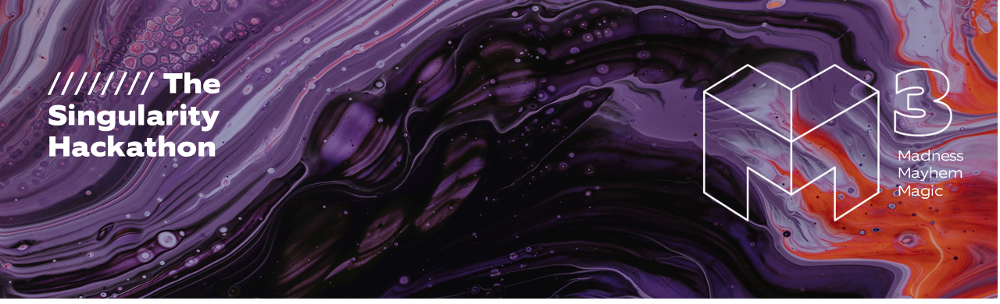
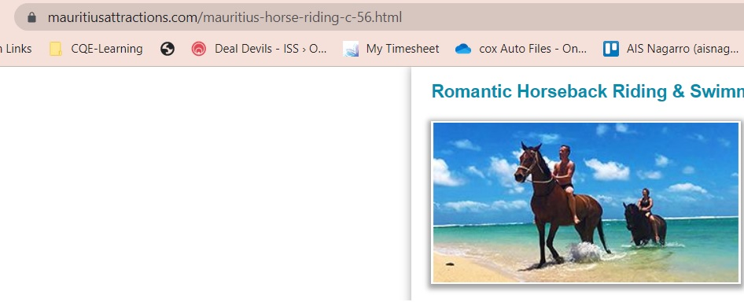

# TheVisionaryVoices
# 
## Problem Statement: Mental wellbeing: 
<h4>Music for the Mind</h4>
<p>Identify a user's emotional state from a picture which he/she is surfing on web, and recommend suitable music to fit and/or improve their mood.</p>

<h4>Cheer Me Up</h4>
<p>Assess a person's emotional state based on the image content he is watching. If they seem to need it, cheer them up in an appropriate manner (e.g. tell jokes, teach them something like meditation to make them feel better).</p>

<h4>Eye for Blind</h4>
<p>Provide a visual description of images for users who are visually impaired.</p>

<h4>Guide For Child</h4>
<p>Provide child-friendly content and features, such as simpler description of visual content.</p>

<h4>Companion For Autism Spectrum</h4>
<p>Provide visual description of images to cater to the needs of users with Autism-spectrum disorders, such as simple and consistent description, clear instructions, and sensory-friendly content.</p>

## Solution: AI Powered Chrome browser extension
<ul>
  <li>To enhance accessibility and foster positivity in image-based content.</li>
  <li>Configurable Extension to cater to the requirements of users with visual impairments, Autism-spectrum disorders, and children, as well as to uplift the overall mood of a user.</li>
  <li>Multi lingual and Multiple AI voice support</li>
  <li>Configurable AI Speech Speed</li>
  <li>Configurable AI Speech Pitch</li>
  <li>Vision Powered By <a href="https://huggingface.co/" target="_blank">Hugging Face</a> - <a href="https://api-inference.huggingface.co/models/nlpconnect/vit-gpt2-image-captioning" target="_blank">vit-gpt2-image captioning model</a></li>
 <li>Logistic Powered By <a href="https://api.openai.com/v1/chat/completions" target="_blank">OpenAI chatgpt API for gpt-3.5-turbo model</a></li>
 <li>Speech Powered By <a href="https://developer.chrome.com/blog/web-apps-that-talk-introduction-to-the-speech-synthesis-api/" target="_blank">speech Synthesis API</a></li>
</ul>


## How to set up in local?

```sh
git clone https://github.com/KhushiSindhu/TheVisionaryVoices.git
```
Run below commands on command propmt
```sh
cd TheVisionaryVoices/
npm i
npm run build
```

- Open Google Chrome extensions page: chrome://extensions/

- Enable developer mode

- Click on [LOAD UNPACKED]

- Select TheVisionaryVoices/dist/ -folder!

- Hover over images on any web pages to see the extension working.


## Examples

<ul>
  <li><a href="https://github.com/KhushiSindhu/TheVisionaryVoices/raw/main/Seabiscuit%20-%20Saturday%20at%2010-34.m4a">"Download audio to listen how the picture would be described to General User"</li>
  <li><a href="https://example.com/image.png">"Download audio to listen how the picture would be described to Visually Impaired User"</li>
  <li><a href="https://example.com/image.png">"Download audio to listen how the picture would be described to Autistic User"</li>
  <li><a href="https://example.com/image.png">"Download audio to listen how the picture would be described to Child User"</li>
</ul>

#### Note:= The user preference can be changed from Settings menu provided by the browser extension.


